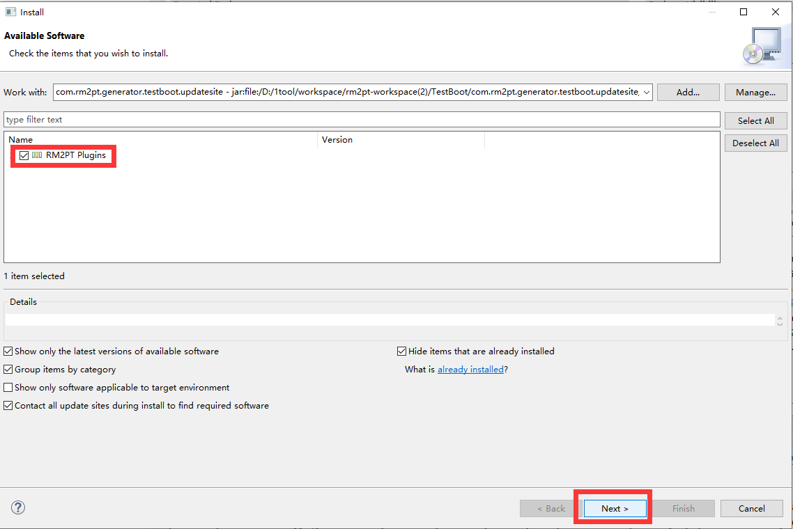

# OCL2NL-Resources

## Overview

This project provides tools for converting Object Constraint Language (OCL) expressions into natural language descriptions. The source code is located in the 'OCL2NL', containing utilities for parsing OCL expressions and generating human-readable descriptions.

Additionally, the project includes a dataset (`1_result.xlsx`) used for training and evaluating the conversion process, and a Python script (`getclarity.py`) for calculating the clarity and accuracy of generated natural language descriptions.

## Table of Contents

- [Code](#code)
- [Installation](#installation)
- [Tutorial](#tutorial)
- [Usage](#usage)
- [Dataset](#dataset)
- [Clarity Calculation](#clarity-calculation)

## Usage

### Code
```text
├── src-gen/com/rm2pt/generator/rm2doc    # Auto-generated source code
├── src/                                 # Source code directory
│   └── com/rm2pt/generator/rm2doc/ocl2nl/
│       ├── service/                     # Service layer
│       └── utils/                       # Utility classes
└── xtend-gen/                           # Xtend-generated Java code
    └── com/rm2pt/generator              # Compiled Java source from .xtend
```
### Installation
#### Prerequest

**OCL2NL** is an advanced feature of **RM2PT**. We recommend you to use OCL2NL as a part of RM2Doc, which is a feature of RM2PT. If you don't have RM2PT, download [here](https://ai4se.com/downloads/).

#### Online Installation

Open RM2PT, click on `Help` -> `Install New Software`


Type http://rm2pt.com/RM2Doc-UpdateSite in the Work with field, select RM2Doc and click Next.


#### Offline Installation

**If the update site does not work**, you can choose to install it offline. Click [here](https://github.com/RM2PT/RM2Doc-UpdateSite/releases/download/v1.0.0/com.rm2pt.generator.rm2doc.updatesite-1.0.0-SNAPSHOT.zip) to download RM2Doc. Follow the steps below to install.




### Tutorial
#### Prerequest

In order to generate natural language descriptions for OCL contracts, you need a requirements model and OCL contracts, the **RM2PT project**. For creating or importing a RM2PT project，you can see the tutorial [here](https://ai4se.com/tutorial/user/create_new_project/).

#### Input of OCL2NL — Requirements Model


The input to OCL2NL is a UML requirements model with OCL constraints. The model includes: a use case diagram, system sequence diagrams, contracts of and system operations.

- **A conceptual class diagram:** A conceptual class diagram is a concept-relation model, which illustrates abstract and meaningful concepts and their relations in the problem domain, in which the concepts are specified as classes, the relations of the concepts are specified as the associations between the classes, and the properties of the concepts are specified as the attributes of the classes.
- **A use case diagram:** A use case diagram captures domain processes as use cases in terms of interactions between the system and its users. It contains a set of use cases for a system, actors represented a type of users of the system or external systems that the system interacts with, the relations between the actors and these use cases, and relations among use cases.
- **System sequence diagrams:** A system sequence diagram describes a particular domain process of a use case. It contains the actors that interact with the system, the system and the system events that the actors generate, their order, and inter-system events. Compared with the sequence diagram in design models, a system sequence diagram treats all systems as a black box and contains system events across the system boundary between actors and systems without object lifelines and internal interactions between objects.
- **Contracts of system operations:** The contract of a system operation specifies the conditions that the state of the system is assumed to satisfy before the execution of the system operation, called the pre-condition and the conditions that the system state is required to satisfy after the execution (if it terminated), called the post-condition of the system operation. Typically, the pre-condition specifies the properties of the system state that need to be checked when system operation is to be executed, and the postcondition defines the possible changes that the execution of the system operation is to realize.

#### Generate NL Contract

After you add a requirements model, you can generate NL contracts for OCL contracts by right click on `cocome.remodel` -> `RM2PT`-> ` Advance Features`-> ` Generate NL Contract`


Refresh your remodel file to see the generated NL contracts


### Calculating Clarity

To calculate the clarity and accuracy of the generated natural language descriptions, use the provided Python script:

```bash
python getclarity.py
```

## Dataset

The dataset used for this project is stored in the `1_result.xlsx` file. This Excel file contains a single sheet that includes the original OCL expressions and their natural language descriptions generated by different models.

#### Sheet Details

The specific structure of this sheet is as follows:

- **First Column (Original OCL)**: Contains the original OCL expressions.
- **Second Column (OCL2NL Translation)**: Contains the natural language descriptions generated using the OCL2NL tool.
- **Third Column (Qwen Translation)**: Contains the natural language descriptions generated using the Qwen model.
- **Fourth Column (GPT Translation)**: Contains the natural language descriptions generated using the GPT model.

## Clarity Calculation

The `getclarity.py` script calculates the clarity and accuracy of the generated natural language descriptions. It extracts key elements from OCL expressions and evaluates the quality of the generated text based on these elements.

